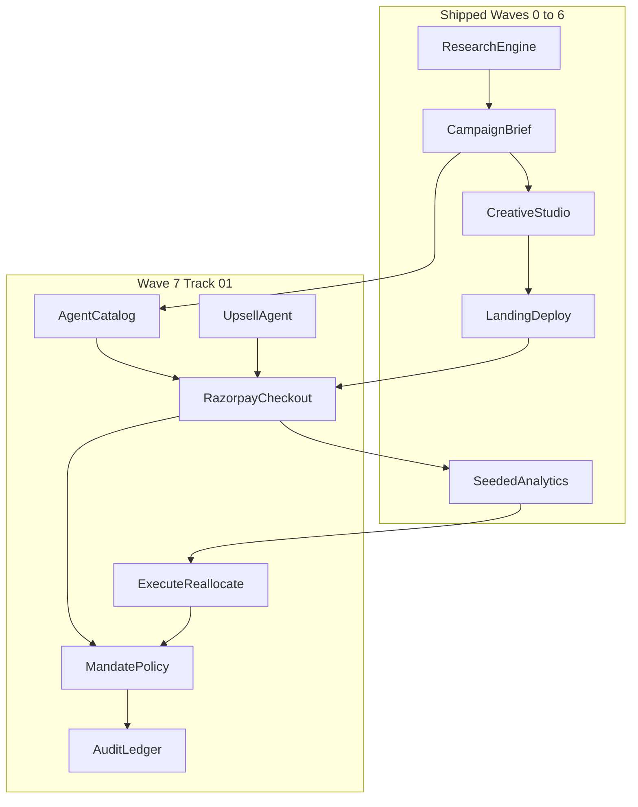

# MediaOS Track 01 — Full Upgrade (no quality or feature cuts)

Official program: [Razorpay AI Buildathon](https://razorpay.com/buildathon/). Application deadline **5 September 2026**. That date is a **submission calendar**, not a permission slip to ship a thinner product. MediaOS already has Waves 0–6 at staff-engineer quality ([Docs/progress.md](Docs/progress.md)); Wave 7 must match that bar: typed, RLS-backed, fail-safe, tested, documented in the same change.

**Quality rule:** if a Track 01 example direction or bar item exists, it ships. Parallelize via the file-claim map. Do not drop catalog, conversational checkout, upsell, audit UI, e2e, or policy tests to “make the deadline.” Submit a complete public repo; keep iterating after submit if needed.

---

## Amplified goal

**One sentence:** MediaOS is an autonomous merchant growth agent that researches Indian buyers, orchestrates a bounded ₹ campaign, makes the merchant transactable by humans and AI buyers on Razorpay test-mode APIs, upsells within policy, and proves every rupee with an audit trail — including graceful payment failure.

**Track 01 asks for one of two builds; we ship both:**

1. An agent that **grows merchant revenue** on Razorpay test-mode APIs (campaign orchestrator).
2. An agent that makes a merchant **transactable by an AI buyer end to end** (agent-readable catalog + checkout session + conversational pay).

**Example directions — all in scope** ([official page](https://razorpay.com/buildathon/)):

- Conversational in-app checkout
- Agent-readable catalog
- Upsell & cross-sell agent
- Campaign orchestrator

**The bar — all in scope:** every money action explainable, bounded, and gated; visible audit trail; **at least one** failure handled gracefully (we implement a **failure matrix**, and demo the headline `payment.failed` stop-rule).

**Success (judge, 5 minutes):** Operator runs research → strategy → creatives → LP → Razorpay pay succeeds → GMV + audit line appear → UPI `failure@razorpay` (or mock Failure) writes a stop-rule event and does not retry the same order → catalog JSON is fetchable → agent proposes an upsell that policy can accept or reject → reallocates ₹ from audience C → B with a written reason.

---

## Judging map (do not optimize for the wrong exam)

| Criterion | Source | What we must show |
|---|---|---|
| Problem taste | [Buildathon](https://razorpay.com/buildathon/), [Razorpay Careers](https://www.linkedin.com/posts/razorpay-careers_razorpaybuildathon-aiinterns-hiring-activity-7497899727838076929-UjeL) | Indian merchant + agentic commerce, not a generic ad generator |
| Build quality | Same + [careerstn write-up](https://careerstn.com/razorpay-ai-buildathon-2026-ai-builder-internship-drive/) | Clean repo, money path typed, tests, live URL |
| AI judgment | Same | LLM for research/copy/strategy; **deterministic** policy, HMAC, CPA math, stop-rules |
| Failure recovery | Form field “what broke”; Track 01 bar | Honest postmortem **and** a demoed `payment.failed` path |
| Track 01 bar | Official page | Explainable + bounded + gated money + audit + graceful failure |

**Application fields** (pre-write in [`Docs/buildathon/submission-draft.md`](Docs/buildathon/submission-draft.md)): Full name, college, graduation year, Bangalore availability, 6 vs 12 months, resume; track `01`, project name, problem statement, public GitHub URL, unlisted 5-minute video URL, what broke and how it was fixed.

**Offer (context, not code):** ₹75,000/month, 6 or 12 months, in-person Bangalore from September, students only, no aptitude/GD — shortlist is the build.

---

## Why now (pitch + architecture, with references)

Track 01 names a **protocol race**. We implement the *ideas* on Razorpay test-mode; we do **not** pretend to be a certified NPCI/OpenAI merchant.

| Protocol | Layer | What we borrow | What we do not fake |
|---|---|---|---|
| NPCI Unified Agent Protocol (UAP) | Agent identity + spend limits on UPI | Named agent, per-merchant caps, consent | Not a public spec; no UPI Circle registry. Cite [ClearingPost](https://clearingpost.com/insights/npci-unified-agent-protocol-agentic-upi/), [Outlook](https://www.outlookbusiness.com/news/india-plans-ai-powered-upi-payments-framework-through-unified-agent-protocol), Razorpay/NPCI Claude pilots ([Stellagent](https://stellagent.ai/insights/india-npci-unified-agent-protocol-upi)) |
| OpenAI + Stripe ACP | Catalog + checkout sessions | Public product feed + `POST /checkout/sessions` subset | Not Instant Checkout inside ChatGPT. Spec: [OpenAI Products API](https://developers.openai.com/commerce/specs/api/products), [ACP schemas](https://github.com/xpaysh/agentic-commerce-plugin-template/tree/main/packages/acp-schemas), [feed guide](https://www.contexthints.com/guide/chatgpt-product-feed.html) |
| Google AP2 | Mandates (signed “what the agent may spend”) | `mandates` row: max paise, expiry, evidence, decidedBy | No Google payment rail |
| Coinbase x402 | HTTP 402 Payment Required | Optional `402` + payment instructions on gated catalog resources | No on-chain settlement |

**Money rail we actually call:** Razorpay **Test Mode** [Orders API + Web Standard Checkout](https://razorpay.com/docs/payments/payment-gateway/web-integration/standard/integration-steps/), [best practices](https://razorpay.com/docs/payments/payment-gateway/web-integration/standard/best-practices/), [webhook validation](https://razorpay.com/docs/webhooks/validate-test/), [test cards](https://razorpay.com/docs/payments/payments/test-card-details/), [test UPI](https://razorpay.com/docs/payments/payments/test-upi-details/).

---

## Current MediaOS (extend, do not rebuild)

Live: [https://mediaos-kappa.vercel.app](https://mediaos-kappa.vercel.app). GitHub: [Adit-Jain-srm/MediaOS](https://github.com/Adit-Jain-srm/MediaOS).

| Stage | Status | Evidence |
|---|---|---|
| Audience intelligence (6 Bright Data providers) | Have | [Docs/research-engine.md](Docs/research-engine.md), `src/lib/research/**` |
| Campaign strategist | Have (plans spend, does not move money) | [Docs/campaigns.md](Docs/campaigns.md), [`suggest_budget`](src/lib/agent/tools/) does not write reallocations |
| Creative agent | Have | [Docs/creative-studio.md](Docs/creative-studio.md) |
| Landing generate/deploy/A/B | Have; CTA is **email** | [`lead_form` / `cta` → `#lead`](src/lib/landing/types.ts), [Docs/landing-pages.md](Docs/landing-pages.md) |
| Operator (17 tools, 16-step budget) | Have; golden path ends at analytics | [`OPERATOR_WORKFLOW`](src/lib/agent/prompts.ts), [`DEFAULT_MAX_STEPS = 16`](src/lib/agent/runtime.ts), [Docs/operator-tools.md](Docs/operator-tools.md), [ADR 0004](Docs/adr/0004-agent-runtime.md) |
| Analytics | Partial | Seeded CTR/CPA; funnel LP/leads are **modeled** (`LP_VIEW_RATE = 0.82`, `CONVERSION_OF_LEAD = 0.55` in [`aggregate.ts`](src/lib/analytics/aggregate.ts)); recs do not execute |
| Razorpay / orders / webhooks / audit | Missing | Zero `razorpay` in `src/`; [`.env.example`](.env.example) has no payment keys |
| Currency | USD default | [`budgetPlanSchema`](src/lib/campaign/brief.ts), [`campaign.tools.ts`](src/lib/agent/tools/campaign.tools.ts) |
| Canonical demo | US finance newsletter | [`DEMO_CAMPAIGN_NAME = "Retirement Income Weekly"`](src/lib/seed/constants.ts) |
| E2E | Login page only | [`e2e/golden-path.spec.ts`](e2e/golden-path.spec.ts) |
| Docs/api.md | Stale | Still lists `/api/lead` Planned; real routes are `/api/leads`, `/api/page-views` |



**Explicitly still out of scope (wrong exam, not a quality cut):** live Meta/Google Ads APIs, Track 02 fraud offense, Track 03 full receivables recovery as the headline, Track 04 50-row reconciliation, claiming certified ACP/UAP, live-mode Razorpay charges.

---

## Positioning

Replace README identity (“AI media buyer”) with:

> MediaOS is an autonomous AI growth agent for Indian merchants. It researches buyers, deploys campaigns, exposes an agent-readable catalog, collects rupees through Razorpay test-mode Checkout, upsells within a signed mandate, and optimizes toward a bounded ₹ objective — with an audit trail on every money action.

Honesty (AI judgment): **simulated** media impressions/clicks vs **captured** Razorpay GMV. Never claim we bought Meta ads.

**Canonical demo merchant (first-class, not a sticker):** Indian D2C digital + physical-adjacent offer, INR.

Recommended SKU set (names can change; structure cannot):

| sku | Product | Price | Role |
|---|---|---|---|
| `AAROGYA-12W` | AarogyaFit 12-week training program | ₹1,499 (149900 paise) | Hero checkout |
| `AAROGYA-NUTR` | Nutrition add-on guide | ₹499 | Upsell |
| `AAROGYA-BUNDLE` | Program + nutrition | ₹1,799 | Cross-sell (₹199 vs à la carte) |

Keep “Retirement Income Weekly” as a **second** seeded campaign so existing research/creative fixtures do not rot; Command Center and Operator golden path **default to AarogyaFit**. Update [`src/lib/seed/constants.ts`](src/lib/seed/constants.ts), landing slug, nav copy ([`src/lib/nav.ts`](src/lib/nav.ts) still says “capture leads”).

---

## Definition of Done (every phase — copy of [Docs/progress.md](Docs/progress.md) Wave 0–6)

A phase is **not done** until all of the following are true (evidence shown, not assumed):

1. **Code** — staff-engineer bar; typed; external calls in `withRetry`/`withTimeout`/`CircuitBreaker`; typed `AppError`s; secrets server-side; RLS respected.
2. **Self-review** — [self-review skill](.cursor/skills/self-review/SKILL.md) checklist on every changed file *and* surrounding callers (landing union, brief decode, funnel, artifact registry, `mockGoldenPath`). Fix silently before presenting.
3. **Unit / integration tests** — written for the new behavior **and** the edge-case matrix below; **passing on a fresh `npm test`**; CI-safe (no live Razorpay/Azure/Bright Data).
4. **E2E** — Playwright extended whenever a public or golden-path surface changed (`npm run test:e2e`).
5. **Docs** — relevant `Docs/` page + `Docs/api.md` if routes changed + `Docs/progress.md` Wave 7 changelog + `Docs/learnings.md` for any gotcha, **in the same change**.
6. **Quality gates** — `npm run typecheck`, `npm run lint`, `npm test`, `npm run build` all green. After UI/checkout: `npm run test:e2e`.
7. **Git** — atomic Conventional Commit(s), then **`git push origin`**. Follow this repo’s history (push after each wave, as Waves 0–6 did). No `--no-verify`. No secrets in the commit (`.env.local` stays gitignored). Message format: `feat(payments): …` / `docs(buildathon): …` / `test(checkout): …`.
8. **Validation** — prove-it: paste command output (pass counts, build success) into the Wave 7 changelog; do not claim done without it.

### Per-phase operating loop (mandatory, 12 steps)

Run this loop **inside every phase** (0–10). Do not skip 6–12 because “it’s just docs” or “tests come later.”

```
1. Implement the phase scope (complete, not a sketch)
2. Silent self-review (types, HMAC, RLS, no any, error paths)
3. Write unit/integration tests for happy path AND edge cases
4. Run npm run typecheck && npm run lint && npm test
5. If the phase touches a user-visible or public route: write/extend Playwright e2e; npm run test:e2e
6. Update Docs (module page + api.md + progress.md + learnings if needed)
7. npm run build (the real integration gate)
8. git status / git diff — confirm no secrets, one logical change
9. git add relevant files; conventional commit
10. git status — confirm clean (or only unrelated leftovers)
11. git push origin HEAD
12. Record evidence in Docs/progress.md Wave 7 changelog (gate numbers + push)
```

If a gate fails: **stop**, diagnose, fix, re-run the full gate; do not push red. If push is rejected: rebase/retry; never `--force` on `main` unless the user explicitly asks.

### Git protocol (this repo)

- Atomic commits; if the message needs “and”, split.
- Conventional types: `feat`, `fix`, `docs`, `test`, `refactor`, `chore`.
- Never commit `.env.local`, keys, webhook secrets, or smoke output images.
- Push after **each** phase so GitHub (the submission artifact) stays current.
- `$env:GH_HTTP_VERSION="HTTP/1.1"` if `git push` flakes on this machine (existing learning).

---

## Phase 0 — Docs pack

**Goal:** Durable source of truth for the hackathon, Wave 7 contract, and execution discipline — before money code.

**Steps:**

1. Create `.cursor/rules/track-01-execution.mdc` — always-apply rule (contents in Execution rule subsection below).
2. Create `Docs/buildathon/` with the files in the table below.
3. Add `Docs/adr/0005-razorpay-money-loop.md` status **Proposed**.
4. Add **Wave 7** section to `Docs/progress.md` (objective, file-claim, this DoD).
5. Add a stub `Docs/payments.md` ("implementation follows"); fill in Phase 2.
6. Self-review: links resolve, citations match official Buildathon text, rule YAML valid.
7. Tests: docs + rule only; confirm repo `npm test` green.
8. Gate: `npm run typecheck`, `npm run lint`, `npm test`, `npm run build`.
9. Commit: `docs(buildathon): capture Track 01 brief, bar, execution rules, and Wave 7 plan`.
10. `git push origin HEAD`. (“implementation follows”) so the module has a home; fill it in Phase 2.
5. Self-review: links resolve, citations match official [Buildathon](https://razorpay.com/buildathon/) text, no invented deadlines.
6. Tests: none required (docs-only) except confirm repo still `npm test` green (no accidental edits).
7. Gate: `npm run typecheck`, `npm run lint`, `npm test`, `npm run build`.
8. Commit: `docs(buildathon): capture Track 01 brief, bar, and Wave 7 plan`.
9. `git push origin HEAD`.
11. Validation: files exist, progress.md links, rule loads in Cursor.

### Execution rule (`.cursor/rules/track-01-execution.mdc`)

Create this file in Phase 0. Frontmatter: `description: "Wave 7 Track 01 — sequential, production-grade, goal-aware, skill-driven"`, `globs: ["**/*"]`, `alwaysApply: true`.

**1. Sequential only — no parallel subagents.** Execute one phase at a time (0 through 10). Never launch parallel Task/subagent workers for implementation. Waves 0–6 succeeded sequentially; Wave 7 does the same. Exception: readonly research (web search, doc fetch) may parallel.

**2. Production-grade — no shortcuts.** Every file matches the staff-engineer bar of Waves 0–6. External calls: `withRetry`/`withTimeout`/`CircuitBreaker`/typed `AppError`. Money: integer paise, never float. Secrets: server-only, never client bundle, never git. UI: zinc+emerald, Geist, Phosphor, reduced-motion safe. Tools: Zod params, `runToolSafely`, fail-safe. Tests: CI-safe, deterministic. "It works" is not done. "Verified, tested, documented, pushed" is done.

**3. Goal awareness — every change serves Track 01.** Before coding, re-read `.cursor/plans/track_01_upgrade_96eff3ff.plan.md`. Every change must serve: campaign orchestrator, conversational checkout, agent-readable catalog, upsell/cross-sell, audit trail, or graceful failure. Track 01 bar: every money action explainable, bounded, gated; audit trail; one failure handled. Do not build Track 02–04 or live ad-network integrations.

**4. Use skills extensively.** Read `.cursor/skills/README.md` at session start. Routing table: code change → self-review; done claim → prove-it; new module → grill; bug → diagnose; Razorpay calls → error-resilience; schema → db-schema; git → git-workflow; perf → web-perf; UI → design-taste-frontend + ui-ux-pro-max; agent tools → ADR 0004 defineTool; long session → session-guard; before building → research-first-execution. If a skill exists, READ its SKILL.md and FOLLOW it. No name-dropping without invoking.

**5. Per-phase delivery loop (12 steps, never skip).** 1-Implement (complete) 2-Self-review 3-Tests (happy+edge) 4-typecheck+lint+test 5-E2E if public route 6-Docs 7-build 8-git diff (no secrets) 9-Conventional commit 10-git status clean 11-git push origin HEAD 12-Evidence in progress.md. Gate fails: stop, fix, re-run. Never push red.

**6. Forbidden.** No subagents for implementation. No skipping tests/docs/push. No `any`. No swallowed errors. No secrets in commits. No "done" without prove-it. No modifying frozen contracts (extend via new files). No editing 0001/0002 SQL. No float money. No client-supplied amounts.

| File | Must contain |
|---|---|
| `README.md` | Index, quality bar, phase list, file-claim map, links |
| `hackathon-brief.md` | All 5 tracks, offer, dates, eligibility, 4 steps, 12 form fields, judging, citations |
| `track-01-bar.md` | Bar decoded; money-action taxonomy; protocol table; failure matrix |
| `gap-analysis.md` | Have / partial / missing with file paths |
| `product-reframe.md` | Positioning, demo merchant, 5-min pitch script, judge click-path |
| `upgrade-spec.md` | Schema, APIs, tools, tests (implementation contract) |
| `protocols.md` | UAP / ACP / AP2 / x402 — what we implement vs cite |
| `submission-draft.md` | Problem statement, architecture paragraph, append-only “what broke” log |
| `adr/0005-razorpay-money-loop.md` | Proposed ADR |
| `payments.md` | Stub → complete in Phase 2 |

---

## Phase 1 — Schema + env + error taxonomy

**Goal:** Queries-first money tables, Razorpay env predicates, typed errors. No Checkout UI yet.

**Implement:**

- `supabase/migrations/0003_razorpay_money_loop.sql` (tables, indexes, RLS, triggers — see Schema section).
- [`src/types/database.ts`](src/types/database.ts) `type` aliases (D8).
- [`src/lib/env.ts`](src/lib/env.ts) + [`.env.example`](.env.example): `NEXT_PUBLIC_RAZORPAY_KEY_ID`, `RAZORPAY_KEY_SECRET`, `RAZORPAY_WEBHOOK_SECRET`; `isRazorpayConfigured()`; `getServiceConfigStatus().razorpay`.
- [`src/lib/errors.ts`](src/lib/errors.ts): `service: "razorpay"`; codes `POLICY_DENIED`, `SIGNATURE_INVALID`, `PAYMENT_FAILED`.
- Env unit tests (configured vs placeholder vs missing).

**Edge cases to test:** missing keys still boot; placeholder `your-` treated as missing; migration SQL is valid Postgres; RLS policies named consistently with 0001.

**Docs:** `Docs/runbook.md` (apply migration), `Docs/progress.md`, `Docs/learnings.md` if types/RLS gotchas.

**E2E:** none yet.

**Gate + git:** full loop. Commit: `feat(payments): add Razorpay money-loop schema and env`. Push.

**Validation:** `npm run typecheck`; `src/lib/env.test.ts` covers razorpay predicate; grep confirms no secrets in the commit.

---

## Phase 2 — Payments core (client, policy, HMAC, demo store)

**Goal:** Deterministic policy + Razorpay HTTP client + dual HMAC + in-memory store. No public LP button yet.

**Implement:** `src/lib/payments/{razorpay,policy,hmac,audit,types,store}.ts`, `src/lib/services/payments.service.ts`. fetch + Basic auth; `withRetry`/`withTimeout`/`CircuitBreaker`. Follow **Technical spec → Payments core** (HMAC algorithms, policy table, mandate shape).

**Unit tests (CI-safe, fixtures, no network):**

- Policy: over-cap, missing/short reason, non-INR, upsell not in graph, expired mandate, remaining budget exceeded, same-order retry after fail.
- HMAC checkout (`order_id|payment_id` + key secret) vs webhook (raw body + webhook secret); wrong secret fails; `timingSafeEqual`; JSON.stringify(parsed) must **fail** verify (raw-body trap).
- Circuit breaker opens after N upstream 5xx.
- Demo store: create order without credentials; GMV stays 0 until captured.

**Docs:** fill [`Docs/payments.md`](Docs/payments.md) to campaigns.md depth; ADR 0005 still Proposed.

**E2E:** none yet.

**Gate + git:** `test(payments): …` if tests split, else one `feat(payments): add policy, HMAC, and Razorpay client`. Push.

**Validation:** `npm test` includes new files; zero network in CI.

---

## Phase 3 — Human checkout (LP → Orders → verify → webhook)

**Goal:** Judge can pay on `/lp/[slug]` in demo or test mode.

**Implement:** checkout section in [`types.ts`](src/lib/landing/types.ts); templates/prompts; Checkout.js from Razorpay CDN; `POST /api/checkout/orders`, `/verify`; `POST /api/webhooks/razorpay`; thanks/failed pages; server-priced SKUs; fulfill only on `payment.captured`/`order.paid`.

**Edge-case tests:**

- Client-supplied amount ignored (tamper).
- Duplicate `idempotencyKey` returns same order.
- Duplicate webhook `event.id` → GMV once.
- Stale webhook (>5 min) → 200, no fulfill.
- Invalid signature → 400, no fulfill, audit `signature_invalid`.
- `payment.failed` → status failed, stop-rule, no retry same `razorpay_order_id`.
- Abandoned `created` > 30 min → `expired`, not GMV.
- Unconfigured Razorpay → demo order + configure banner, no crash.
- Webhook returns 200 quickly (handler does not await heavy work beyond persist).

**E2E (Playwright, mocked Razorpay):**

- `e2e/checkout-success.spec.ts` — deployed LP → Pay → mocked order/verify → thanks shows receipt.
- `e2e/checkout-failure.spec.ts` — mocked `payment.failed` → failed page + stop-rule copy.
- Keep existing login spec green.

**Docs:** [`Docs/landing-pages.md`](Docs/landing-pages.md), [`Docs/api.md`](Docs/api.md) (fix stale `/api/lead` → `/api/leads` and add checkout/webhook), runbook (Checkout.js, test cards, test UPI).

**Gate:** include `npm run test:e2e`. Commit: `feat(checkout): Razorpay Standard Checkout on landing pages`. Push.

**Validation:** e2e traces or screenshots in CI-safe mode; build lists new routes.

---

## Phase 4 — Agentic commerce (catalog, sessions, conversational pay)

**Goal:** Merchant is transactable by an AI buyer, not only a human on `/lp`.

**Implement:** `GET /api/commerce/catalog`, JSON-LD on LP, `public/llms.txt`, checkout sessions CRUD, `POST /api/commerce/chat` (rate-limited), optional 402 on premium offer. Operator tools `list_catalog`, `create_checkout_session`, `explain_money_action`.

**Edge-case tests:** catalog schema required fields; unknown sku 404; session complete without payment does not mark paid; chat cannot read other users’ campaigns; rate limit; 402 then unlock after paid.

**E2E:** `e2e/catalog.spec.ts` — GET catalog JSON; create session; reject unsigned complete.

**Docs:** `Docs/buildathon/protocols.md` implementation notes; `Docs/api.md` commerce routes; `Docs/operator-tools.md` new tools.

**Gate + git:** `feat(commerce): agent-readable catalog and checkout sessions`. Push.

**Validation:** curl catalog locally in prove-it notes; Playwright passes.

---

## Phase 5 — Upsell / cross-sell + campaign orchestrator

**Goal:** Example direction “upsell & cross-sell” + recs that **write** budget.

**Implement:** product graph; `recommend_upsells`; checkout `upsellSkus` policy; `reallocate_budget` / `apply_recommendation`; INR `budgetPlanSchema.audienceAllocations`; seed A/B/C table.

**Edge-case tests:** duplicate upsell rejected; bundle cheaper than à la carte enforced or explained; allocations normalize to 100%; reallocate without reason denied; pause/scale ids must exist.

**E2E:** optional Operator demo-mode script assertion if cheap; otherwise unit + one Playwright that hub shows new allocation after a mocked apply.

**Docs:** [`Docs/campaigns.md`](Docs/campaigns.md), operator-tools.

**Gate + git:** `feat(growth): gated upsells and executable budget reallocations`. Push.

---

## Phase 6 — Audit UI + analytics GMV funnel

**Goal:** Bar item “show the audit trail”; honest simulated vs captured metrics.

**Implement:** `/campaigns/[id]/audit` (or hub tab); Operator `audit-timeline` artifact; Command Center GMV; [`funnel()`](src/lib/analytics/aggregate.ts) uses real `page_views` + `orders`; labels on simulated impressions/clicks.

**Edge-case tests:** funnel monotonic; unpaid orders excluded from GMV; denied mandates still appear in audit; empty campaign empty-state.

**E2E:** `e2e/audit-trail.spec.ts` — after mocked payment, audit page lists `order_created` and `payment_captured`.

**Docs:** [`Docs/analytics.md`](Docs/analytics.md) (remove “modeled LP/lead ratios” as the Track 01 truth; document both modes).

**Gate + git:** `feat(audit): money-action timeline and Razorpay GMV funnel`. Push.

---

## Phase 7 — Operator prompts, tools registration, canonical seed, copy

**Goal:** Golden path runs end-to-end in demo mode; AarogyaFit is the default demo.

**Implement:** `createPaymentTools` + `createCommerceTools` registered in [`tools/index.ts`](src/lib/agent/tools/index.ts); [`OPERATOR_IDENTITY` / `OPERATOR_WORKFLOW`](src/lib/agent/prompts.ts); `DEFAULT_MAX_STEPS = 24`; `mockGoldenPath` includes checkout + scorecard; [`src/lib/seed/constants.ts`](src/lib/seed/constants.ts) AarogyaFit + keep retirement as second campaign; [`src/lib/nav.ts`](src/lib/nav.ts); README positioning.

**Edge-case tests:** `validateDemoSeedConsistency`; module-tools tests for new tools (`runToolSafely`); demo mode still works with zero Razorpay keys.

**E2E:** `e2e/golden-path.spec.ts` expanded — Command Center shows AarogyaFit GMV card; Operator page renders.

**Docs:** operator-tools catalog count; README three answers rewritten; architecture mermaid.

**Gate + git:** `feat(operator): Track 01 golden path and AarogyaFit demo seed`. Push.

**ADR 0005 → Accepted** in this commit or the next if anything remaining is cosmetic.

---

## Phase 8 — Full e2e, edge-case sweep, smoke, prove-it

**Goal:** Cross-phase validation. No new features except test harness + `scripts/smoke-razorpay.mjs` + `package.json` `smoke:razorpay`.

**Steps:**

1. Inventory every row of the **failure matrix** and the **edge-case lists in Phases 1–7**; add any missing unit tests.
2. Playwright suite (all must pass, mocked):
   - login (existing)
   - catalog GET
   - checkout success
   - checkout failure + stop-rule
   - audit trail
   - golden-path surfaces (Command Center, Operator, `/lp/{aarogya-slug}`)
3. Add `scripts/smoke-razorpay.mjs` (creds-gated, **not CI**): create test-mode order, assert `order_` prefix. Mirror azure/brightdata smokes.
4. Run **full gate**: `npm run typecheck && npm run lint && npm test && npm run test:e2e && npm run build`.
5. If keys present: `npm run smoke:razorpay` (optional locally); record in learnings, not CI.
6. Self-review test names: they describe behavior, not implementation.
7. Docs: runbook “Verification” section with exact commands; progress.md evidence (test counts).
8. Commit: `test(track-01): e2e golden path, failure matrix, and Razorpay smoke`.
9. Push.
10. Validation: paste gate output into progress.md. **This is the prove-it checkpoint before live deploy.**

**Regression rule:** if this phase finds a product bug, fix it here with a `fix(…)` commit, re-run the full gate, then push. Do not “note it for later.”

---

## Phase 9 — Live deploy and Razorpay Dashboard

**Goal:** Production URL actually charges test-mode and receives webhooks.

**Steps:**

1. Set Vercel env: `NEXT_PUBLIC_RAZORPAY_KEY_ID`, `RAZORPAY_KEY_SECRET`, `RAZORPAY_WEBHOOK_SECRET` (Test Mode only).
2. Apply migration `0003` on the Supabase project used by production.
3. Razorpay Dashboard → Test Mode → Webhooks → `https://mediaos-kappa.vercel.app/api/webhooks/razorpay`; events `payment.captured`, `payment.failed`, `order.paid`; secret ≥ 32 chars matching env.
4. Deploy (push already triggers Vercel; confirm build green).
5. **Live validation (human + agent):**
   - Success: [test card](https://razorpay.com/docs/payments/payments/test-card-details/) or mock Success → thanks → Command Center GMV → audit `payment_captured`.
   - Failure: [UPI `failure@razorpay`](https://razorpay.com/docs/payments/payments/test-upi-details/) or mock Failure → failed page → audit stop-rule; second pay creates a **new** order.
   - Catalog: `GET https://mediaos-kappa.vercel.app/api/commerce/catalog` returns INR items.
6. Document webhook URL and test receipts in runbook (no secrets).
7. Append “what broke” in `submission-draft.md` for any live mismatch (e.g. raw-body, image endpoint class of bug).
8. Commit only if code/docs changed (`docs(runbook): Razorpay test-mode webhook and live checklist`). Push.
9. Validation: screenshots/URLs in progress.md; live build ID.

**Edge cases live:** webhook not registered → verify-only path still does not fulfill (honest); missing secret → configure state, no crash.

---

## Phase 10 — Pitch, architecture, submit

**Goal:** Application packet. Code is already complete from Phases 0–9.

**Steps:**

1. Finalize 5-min script in `product-reframe.md`; click-path matching live URL.
2. Architecture diagrams in `Docs/architecture.md` + README (Operator tools / policy / Razorpay / audit).
3. Fill `submission-draft.md`: problem statement, repo URL, architecture paragraph, **what broke** (real incidents from Phases 8–9).
4. Record unlisted 5-min video (human); paste URL into submission-draft.
5. Final gate: `npm run typecheck && npm run lint && npm test && npm run test:e2e && npm run build`.
6. `git status` clean on the Wave 7 commits; `git push origin HEAD` if anything left.
7. Submit the [Buildathon form](https://razorpay.com/buildathon/) (track 01, public GitHub, video, resume).
8. Validation: form confirmation; public repo HEAD matches Vercel.

---

## Tests and verification (master list)

Reuse across phases. CI (`npm test`) never hits Razorpay. E2E mocks Checkout. Smoke/live are creds-gated.

**Commands (prove-it):**

```
npm run typecheck
npm run lint
npm test
npm run test:e2e
npm run build
# optional, local only:
npm run smoke:razorpay
```

**Unit (CI-safe):** policy matrix; dual HMAC + raw-body trap; webhook idempotency + stale event; amount tamper; failed-payment stop-rule; catalog schema; funnel monotonic + paid stage; audience allocations ~100%; demo seed ids; env predicates; `runToolSafely` on money tools.

**E2E (Playwright):** login; catalog; checkout success; checkout failure; audit trail; golden-path surfaces.

**Smoke / live:** create `order_` in test mode; one captured payment; one `failure@razorpay`; catalog 200 on production.

**Honesty:** UI labels simulated media vs captured Razorpay GMV.

---

## Technical spec (referenced by Phases 1–5)

The numbered phases above are the **delivery loop** (implement → test → docs → gate → commit → push). This section is the **implementation contract** those phases execute. These headings are **not** a second phase sequence.

### Payments core (Phase 2 implements)

Match existing clients: [`src/lib/ai/azure.ts`](src/lib/ai/azure.ts), [`src/lib/research/brightdata.ts`](src/lib/research/brightdata.ts). **fetch + Basic auth** to `https://api.razorpay.com/v1/orders` ([integration steps](https://razorpay.com/docs/payments/payment-gateway/web-integration/standard/integration-steps/)). Wrap every call in [`withRetry` / `withTimeout` / `CircuitBreaker`](src/lib/resilience.ts). Amounts **integer paise only** ([db-schema skill](.cursor/skills/db-schema/SKILL.md): never FLOAT for money).

### Env ([`src/lib/env.ts`](src/lib/env.ts), [`.env.example`](.env.example))

- `NEXT_PUBLIC_RAZORPAY_KEY_ID` — `rzp_test_…` (Checkout.js only)
- `RAZORPAY_KEY_SECRET` — server; checkout signature
- `RAZORPAY_WEBHOOK_SECRET` — server; **different** from key secret ([why they differ](https://dev.to/eventdock/how-to-verify-razorpay-webhook-signatures-and-why-it-is-not-the-payment-signature-1pei))
- `RAZORPAY_KEY_ID` optional server mirror if we do not want public key in some tests

`isRazorpayConfigured()` + extend `getServiceConfigStatus()` with `razorpay`. App **boots without keys** (same as Azure): in-memory orders + scripted Operator demo.

### Error taxonomy ([`src/lib/errors.ts`](src/lib/errors.ts))

Add `service: "razorpay"`. Add codes used by policy and webhooks: `POLICY_DENIED`, `SIGNATURE_INVALID`, `PAYMENT_FAILED`, `IDEMPOTENT_REPLAY` (or map replay to existing `VALIDATION` with context). Never string-match in tools.

### Two HMAC paths (test vectors required)

**Checkout handler** ([Custom Checkout verify](https://razorpay.com/docs/developer-tools/integrations/custom-checkout/), same for Standard handler):

```
HMAC-SHA256(key = RAZORPAY_KEY_SECRET, msg = order_id + "|" + payment_id)
compare with crypto.timingSafeEqual
```

**Webhook** ([validate-test](https://razorpay.com/docs/webhooks/validate-test/)):

```
HMAC-SHA256(key = RAZORPAY_WEBHOOK_SECRET, msg = RAW body bytes)
header X-Razorpay-Signature
```

Next.js App Router: `const raw = await request.text()` then `JSON.parse(raw)`. Never `JSON.stringify(parsed)` for verify. `runtime = "nodejs"`. Return **HTTP 200 within 5 seconds**; persist receipt first, process idempotently. Replay guard: ignore `created_at` older than 5 minutes **after** signature verifies (still 200). Duplicate `event.id` → no double GMV.

### Policy engine (`src/lib/payments/policy.ts`) — deterministic, not LLM

LLM **proposes**; policy **gates**. Every gated call writes `audit_events` whether allowed or denied.

| Rule | Default (configurable constants) |
|---|---|
| Currency for live Razorpay orders | `INR` only |
| Max single order | ₹5,000 (500000 paise) |
| Max campaign budget | ₹50,000 |
| Max agent-initiated orders / 10 min / campaign | 20 |
| Reason min length | 24 chars |
| Mandate required | `create_order`, `reallocate_budget`, `apply_upsell`, `issue_refund` (test-mode refund API if we enable it) |
| Remaining budget | order + allocated media plan cannot exceed `budget.total` |
| Same-order retry after `payment.failed` | **forbidden** (stop-rule) |

AP2-style **mandate** persisted before the Razorpay call:

```
{ action, amountPaise, maxPaise, currency, expiresAt, reason, evidence[],
  actor: "operator" | "buyer" | "policy" | "webhook",
  decidedBy: "policy" | "user",
  status: "active" | "consumed" | "denied" | "expired" }
```

---

### Human checkout (Phase 3 implements)

### Landing document

Add `checkout` to the discriminated union in [`src/lib/landing/types.ts`](src/lib/landing/types.ts). Fields: `sku`, `ctaLabel`, `showUpsells`, `successPath`. Update templates so primary CTA is `#pay` (keep `lead_form` as optional email capture). Generator prompts ([`src/lib/landing/prompts.ts`](src/lib/landing/prompts.ts)) must emit checkout for sales objectives.

Public page [`src/app/lp/[slug]/page.tsx`](src/app/lp/[slug]/page.tsx): load Checkout.js from **Razorpay CDN only** ([best practices](https://razorpay.com/docs/payments/payment-gateway/web-integration/standard/best-practices/)). Client never sets amount; it only sends `sku` + `landingPageId` + UTM.

### Server order create

`POST /api/checkout/orders`

- Zod: `sku`, `landingPageId`, `upsellSkus[]`, UTMs, `idempotencyKey`
- Resolve product prices **server-side**; compute `amountPaise`; reject client-supplied amounts
- Policy + mandate
- `POST https://api.razorpay.com/v1/orders` with `amount`, `currency: INR`, `receipt`, `notes: { campaign_id, landing_page_id, sku, mediaos_order_id }`
- Persist `orders` + `order_items` as `created`
- Audit `order_created`

`POST /api/checkout/verify` — handler triple; mark `authorized` locally; **do not fulfill** until webhook `payment.captured` / `order.paid` (Razorpay: [check status before providing services](https://razorpay.com/docs/payments/payment-gateway/web-integration/standard/best-practices/)).

`POST /api/webhooks/razorpay` — events: `payment.captured`, `payment.failed`, `order.paid`. Optional later: `refund.processed`.

### Pages

- `/lp/[slug]/thanks?order=` — success, GMV receipt, audit id
- `/lp/[slug]/failed?order=` — failure copy + “agent will not retry this order” + next action (new order only)

### Failure matrix (demo the first; implement all)

| Failure | How to trigger | Agent/system behavior |
|---|---|---|
| Payment failed | [Test UPI `failure@razorpay`](https://razorpay.com/docs/payments/payments/test-upi-details/) or mock bank **Failure**; [test cards](https://razorpay.com/docs/payments/payments/test-card-details/) | Audit `payment_failed`; stop-rule; no retry same `razorpay_order_id`; Operator `{ ok:false, code:"PAYMENT_FAILED", stop:true }` |
| Signature mismatch | Fixture | 400; no fulfill; audit `signature_invalid` |
| Policy denied (over cap / bad reason) | Unit + Operator | `{ ok:false, code:"POLICY_DENIED" }`; audit `mandate_denied` |
| Razorpay timeout / 5xx | Mock | Retry with backoff; then `UPSTREAM`; circuit breaker open |
| Duplicate webhook | Replay same `event.id` | 200; GMV counted once |
| Abandoned checkout | Order `created` > 30 min, no payment | `expired`; audit; not counted as GMV |
| Amount tamper | Client posts wrong paise | Ignored; server price wins; test asserts |

Test OTP notes (Standard Checkout guide): 4-digit OTP succeeds; 5-digit starting with 1 fails — document in runbook for the pitch.

---

### Agentic commerce (Phase 4 implements)

This is the second Track 01 clause, shipped as a real surface, not a JSON souvenir.

### Catalog feed

`GET /api/commerce/catalog` (public, cache-Control short)

ACP-inspired items (not a claim of certification):

```
{
  "spec": "mediaos-acp-inspired/2026-09",
  "merchant": { "name", "country": "IN", "psp": "razorpay_test" },
  "items": [{
    "id", "title", "description", "url", "image_url",
    "price": { "amount_paise", "currency": "INR" },
    "availability": "in_stock",
    "is_eligible_search": true,
    "is_eligible_checkout": true,
    "upsell_skus": [], "cross_sell_skus": [],
    "checkout": { "create_session": "/api/commerce/checkout/sessions" }
  }]
}
```

Also: `GET /api/commerce/catalog.jsonld` or JSON-LD `<script>` on `/lp/[slug]` (`Product` + `Offer`, `priceCurrency: INR`). `public/llms.txt` pointing agents at the catalog and checkout contract.

Optional x402: gated `GET /api/commerce/offers/premium` returns **402** with `{ accept: [{ psp: "razorpay", sku, amount_paise }] }` then unlocks after `order.paid`. Small, but it makes the protocol table real.

### Checkout sessions (ACP subset)

From [ACP checkout schema family](https://github.com/xpaysh/agentic-commerce-plugin-template/tree/main/packages/acp-schemas):

- `POST /api/commerce/checkout/sessions` — `{ items: [{ id, quantity }], buyer? }` → session with line totals, mandate preview, `razorpay_order_id` once policy passes
- `GET /api/commerce/checkout/sessions/:id`
- `POST /api/commerce/checkout/sessions/:id/complete` — buyer/agent confirms; we do not capture without Razorpay payment

### Conversational checkout

Two entry points, same service layer:

1. **Merchant Operator** tools: `list_catalog`, `create_checkout_session`, `recommend_upsells`, `explain_money_action`
2. **Public AI-buyer** `POST /api/commerce/chat` (rate-limited, no merchant data leak): natural language “buy the 12-week program + nutrition” → session → Razorpay Checkout link or order_id for Checkout.js

Demo script: Operator *and* a curl against catalog → session → test payment.

---

### Upsell and orchestrator (Phase 5 implements)

### Upsell agent

- `products` rows with `upsell_of` / `cross_sell` graph
- Tool `recommend_upsells`: research pain points + cart sku → ranked add-ons with **reason** (evidence from research artifact ids)
- Checkout accepts `upsellSkus` only if policy (bundle cap, no duplicate, in-graph)
- Audit `upsell_applied` / `upsell_rejected`

### Objective

Maximize **captured GMV** (sum of paid `orders.amount_paise`) subject to campaign `budget.total` ₹10,000 seed. Brief: `objective: "sales"`, `currency: INR`.

### Audience allocations

Extend [`budgetPlanSchema`](src/lib/campaign/brief.ts):

```
audienceAllocations: [{
  personaId, percent, rationale,
  observedCtr?, observedCvr?, observedCpaPaise?,
  gmvPaise?
}]
```

Seed three audiences (your A/B/C table), INR CPA. New tools **write** state (today recs are display-only in [`recommendations.ts`](src/lib/analytics/recommendations.ts)):

| Tool | Writes |
|---|---|
| `reallocate_budget` | `campaigns.budget` jsonb + audit |
| `apply_recommendation` | scale/pause/refresh/reallocate with mandate |
| `get_growth_scorecard` | per-audience CTR/CVR/CPA **and** Razorpay GMV |

Recommendations grow a `execute` hook: Operator can apply them in one gated call.

---

## Schema (queries-first)

New file only: `supabase/migrations/0003_razorpay_money_loop.sql`. Do not edit frozen [`0001_init.sql`](supabase/migrations/0001_init.sql) / [`0002_storage.sql`](supabase/migrations/0002_storage.sql). Follow [ADR 0003](Docs/adr/0003-rls-strategy.md): denormalized `user_id`, owner policy, public insert only via deployed-page join. Types in [`src/types/database.ts`](src/types/database.ts) as **`type` aliases** (D8). Money: `bigint` paise. `set_updated_at` trigger on every table.

### Queries the schema must serve (index each)

1. Audit timeline: `WHERE campaign_id = $1 ORDER BY created_at DESC LIMIT 100`
2. Webhook idempotency: `WHERE event_id = $1`
3. Order by Razorpay id: `WHERE razorpay_order_id = $1`
4. GMV: `WHERE campaign_id = $1 AND status = 'paid'`
5. Payments by order: `WHERE order_id = $1`
6. Catalog: `WHERE status = 'active' ORDER BY sort_order`
7. Open mandates: `WHERE campaign_id = $1 AND status = 'active' AND expires_at > now()`
8. Abandoned: `WHERE status = 'created' AND created_at < now() - interval '30 minutes'`

### Tables

**`products`** — `id`, `user_id`, `sku` unique per user, `title`, `description`, `amount_paise`, `currency` default `INR`, `image_url`, `landing_path`, `availability`, `upsell_skus jsonb`, `cross_sell_skus jsonb`, `is_eligible_checkout`, `sort_order`, timestamps.

**`orders`** — `id`, `user_id`, `campaign_id`, `landing_page_id`, `product_id`, `razorpay_order_id` unique nullable, `receipt`, `amount_paise`, `currency`, `status` (`created|attempted|paid|failed|expired`), `mandate_id`, `utm jsonb`, `notes jsonb`, `idempotency_key` unique, timestamps. Index `(user_id, campaign_id, status)`, `(razorpay_order_id)`.

**`order_items`** — line sku, qty, `amount_paise`, `role` (`primary|upsell|cross_sell`).

**`payments`** — `razorpay_payment_id` unique, `order_id`, `status`, `method`, `error_code`, `error_description`, `payload jsonb` (redact), timestamps.

**`mandates`** — action, bounds, expiry, reason, evidence, decidedBy, status.

**`audit_events`** — `actor`, `action`, `campaign_id`, `order_id`, `mandate_id`, `reason`, `before jsonb`, `after jsonb`, `ok boolean`, `error_code`, `created_at`. **Append-only** (no update/delete policies for authenticated except select).

**`webhook_receipts`** — `event_id` unique, `event_name`, `signature_ok`, `processed_at`, `raw_hash` (store hash, not necessarily full PII body).

Public `orders` insert: same pattern as `leads` — anon insert only if `landing_page_id` is deployed and `user_id` matches page owner. Webhook writes use service role.

In-memory stores mirror campaign/landing pattern so demo works with zero Razorpay/Supabase.

---

## Agent + UI file map (file-claim for parallel work)

Frozen contracts (extend, do not rewrite): [`src/lib/errors.ts`](src/lib/errors.ts), [`src/lib/resilience.ts`](src/lib/resilience.ts), [`src/lib/env.ts`](src/lib/env.ts), [`src/lib/agent/types.ts`](src/lib/agent/types.ts), [`src/lib/research/standard-models.ts`](src/lib/research/standard-models.ts).

| Claim | Owns |
|---|---|
| payments-core | `src/lib/payments/**`, `src/lib/services/payments.service.ts` |
| checkout-http | `src/app/api/checkout/**`, `src/app/api/webhooks/razorpay/**` |
| commerce-http | `src/app/api/commerce/**`, `public/llms.txt` |
| landing-checkout | `src/lib/landing/types.ts` (+ templates/generate), `src/components/landing-page/checkout-*.tsx`, `src/app/lp/[slug]/{thanks,failed}` |
| campaign-budget | `src/lib/campaign/brief.ts`, budget UI, hub audit panel |
| analytics-gmv | `src/lib/analytics/aggregate.ts` (real LP views/leads/orders join), charts, labels |
| operator-money | `src/lib/agent/tools/payments.tools.ts`, `commerce.tools.ts`, `artifacts.ts`, `artifact-view.tsx`, `prompts.ts`, `runtime.ts` step budget **24**, `mockGoldenPath` |
| schema | `supabase/migrations/0003_*.sql`, `src/types/database.ts` |
| seed | `src/lib/seed/constants.ts` + fixtures |
| docs | `Docs/buildathon/**`, ADR 0005, module docs, README |

**Operator identity rewrite** in [`OPERATOR_IDENTITY`](src/lib/agent/prompts.ts): growth agent, not “media buyer.” Principles: never move money without a mandate; cite evidence; label simulated vs captured GMV.

**Golden path (replace `OPERATOR_WORKFLOW`):**

1. `research_audience`
2. `create_campaign` (INR, sales, ₹10,000)
3. `generate_creatives` / `score_creative`
4. `build_landing_page` / `deploy_landing_page`
5. `publish_catalog` / `list_catalog`
6. `recommend_upsells`
7. `create_checkout_session` (configure Razorpay; human or AI buyer pays)
8. `get_growth_scorecard`
9. `reallocate_budget` or `apply_recommendation` (gated)
10. On `PAYMENT_FAILED`: explain stop-rule; offer **new** session only

Artifact types: `mandate`, `order`, `audit-timeline`, `catalog`, `growth-scorecard`, `upsell-set`.

**Nav + Command Center:** add GMV, last payment, audit teaser; landing nav description “checkout,” not only leads. New cockpit route `/campaigns/[id]/audit` (or hub tab) so judges do not need to replay chat. Design: Linear-like activity log (timestamp, actor, reason, bounds, link to Razorpay ids). Use existing zinc+emerald, Geist, Phosphor; no new icon family.

---

## Analytics funnel (replace modeled ratios for Track 01 campaign)

Today ([`funnel()`](src/lib/analytics/aggregate.ts)):

`Impressions → Clicks → LP Views (0.82) → Leads (modeled) → Conversions (seeded)`

Target:

`Impressions (simulated, labeled) → Clicks (simulated, labeled) → LP Views (real page_views) → Checkout started (orders created) → Paid (payments captured) → GMV paise`

Leads remain a side path. CPA for the orchestrator = planned spend paise / paid orders (declare formula). Second headline metric: **Razorpay GMV**. Recommendations may use simulated CTR for creative fatigue **and** real GMV for reallocation; UI must show which.

---

## Pitch (store full script in `product-reframe.md`)

| Time | Beat |
|---|---|
| 0:00–0:30 | Small Indian merchants have no media + no agentic checkout. UAP/ACP/AP2 are the 2026 problem; Razorpay test-mode is the rail. |
| 0:30–1:00 | MediaOS: research → orchestrate → catalog → Razorpay rupee → optimize, with mandates. |
| 1:00–2:30 | Live: Operator chain; pay ₹1,499 test card; GMV ticks. |
| 2:30–3:30 | Architecture: tools vs policy vs audit vs webhooks (diagram). Show catalog JSON. |
| 3:30–4:30 | Scorecard A/B/C; agent reallocates C→B; **failure@razorpay** stop-rule. |
| 4:30–5:00 | Closes acquisition to payment; merchant is sellable to AI buyers. |

---

## Execution calendar (schedule only — scope does not shrink)

Each row is a **phase** and includes the 12-step loop (tests, docs, gate, commit, **push**). Parallelize only independent file-claims; serialize git.

| Phase | Outcome |
|---|---|
| 0 | Docs pack + ADR 0005 Proposed + Wave 7 tracker; push |
| 1 | Schema + env + errors; unit tests; push |
| 2 | Policy + HMAC + Razorpay client; edge-case tests; Docs/payments.md; push |
| 3 | LP checkout + webhook; Playwright success/fail; push |
| 4 | Catalog + sessions + conversational checkout; catalog e2e; push |
| 5 | Upsell + executable reallocations; push |
| 6 | Audit UI + real GMV funnel; audit e2e; push |
| 7 | Operator golden path + AarogyaFit seed + README; push |
| 8 | Full e2e + failure-matrix sweep + smoke script; prove-it; push |
| 9 | Vercel env + Dashboard webhook + live success and `failure@razorpay` |
| 10 | Pitch video, submission-draft, final gate, push, apply |

If the calendar is tight, **add parallelism**, do not delete catalog, upsell, conversational checkout, audit, e2e, or tests.

---

## Prerequisites (human)

1. Razorpay Dashboard **Test Mode** keys and webhook secret (≥32 chars) → production webhook URL.
2. Student eligibility + Bangalore availability for the form.
3. Record unlisted 5-minute video from the script; repo holds architecture and click-path.

---

## Self-review of this plan

### v1 → v2 (scope)

v1 optimized for 4 days and would have failed the Track 01 *examples* and this repo’s own quality gate. v2 restored full feature scope (catalog, conversational checkout, upsell, mandates, AarogyaFit, failure matrix).

### v2 → v3 (delivery loop — this revision)

v2 specified *what* to build but implied process. An executor could skip git push, docs, e2e, or edge cases until “the end.” v3 makes the process **unskippable per phase**.

| v2 gap | v3 fix |
|---|---|
| Phases listed features, not steps | Phases 0–10 each have numbered steps |
| Git “at the end” | 12-step loop: commit + `git push origin HEAD` **every** phase |
| Docs drift | Module docs + api.md + progress.md + learnings in the same change |
| E2E as a leftover todo | Playwright files named per phase; Phase 8 is a dedicated sweep |
| Edge cases in one appendix | Edge-case tests listed inside Phases 1–7 and re-swept in Phase 8 |
| No live validation phase | Phase 9: Vercel + Dashboard webhook + real test-card / `failure@razorpay` |
| Duplicate old Phase 1–4 headings | Renumbered 0–10; old text is **Technical spec**, not a second sequence |
| Prove-it optional | Gate commands + evidence in progress.md before claiming done |
| No failure handling for the *process* | Gate red → stop and fix; no push; no `--force` on main |

**Implementation self-review (when coding):** [self-review skill](.cursor/skills/self-review/SKILL.md) on every file (types, HMAC timing, RLS, no `any`, no swallowed errors). Surrounding context: landing union, campaign brief decode, analytics funnel callers, Operator artifact registry, `mockGoldenPath`. Do not present first drafts.

**Plan consistency check (this revision):** todos in frontmatter match Phases 0–10; technical spec maps to Phases 2–5; schema section maps to Phase 1; pitch maps to Phase 10; master test list maps to Phase 8. No second “Phase 1” delivery sequence remains.
