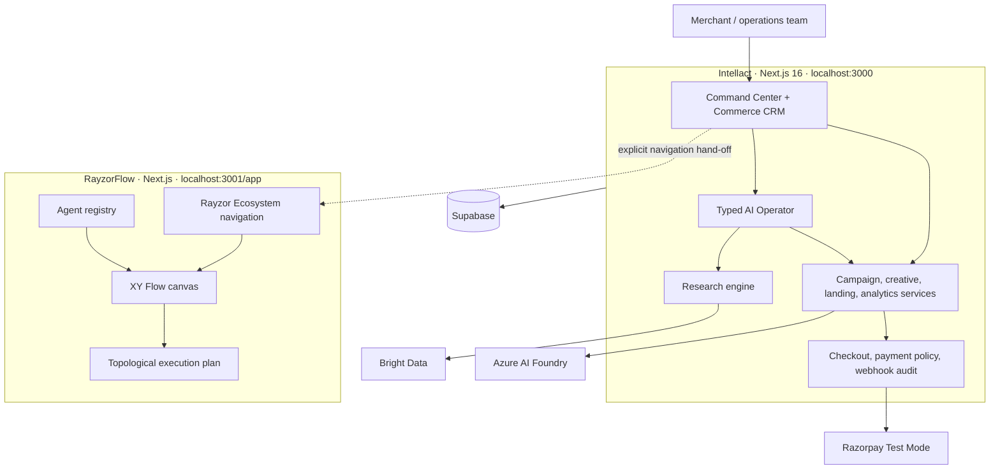
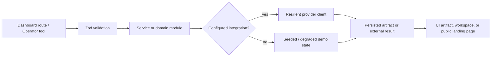
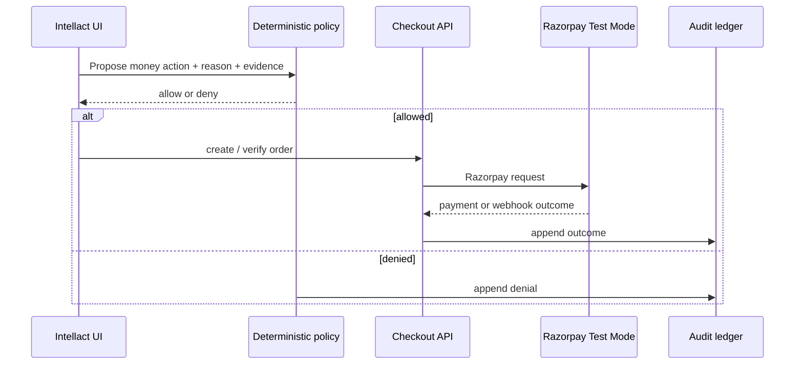

# Intellact Architecture

Intellact is a Next.js commerce CRM and agentic-growth workspace. It owns merchant-facing context and commerce outcomes: campaigns, landing pages, checkout, payment verification, audit records, and the Commerce CRM worklist. Its companion application, **RayzorFlow**, is a separate workflow composer that owns graph execution order.

The boundary is intentional: RayzorFlow can prepare a governed workflow, but it is not a second source of truth for customers or payments.

## System context



## Intellact request path



### Primary layers

| Layer | Implemented location | Role |
|---|---|---|
| Routes | `src/app/` | Dashboard, public landing-page, and API entry points |
| UI | `src/components/` | CRM, Operator, landing, campaign, research, analytics surfaces |
| Services | `src/lib/services/` | Stable contracts for campaign, creative, landing, analytics data |
| Domain modules | `src/lib/{agent,research,payments,landing,campaign,creative}/` | Validation, policy, orchestration, and feature logic |
| Integrations | `src/lib/{supabase,ai,research, payments}/` | External-client boundary and resilience |
| Storage | `supabase/migrations/` | RLS-scoped application and commerce data model |

## Commerce boundary



The policy engine is deterministic, not model-decided. It enforces INR currency, amount and campaign caps, a minimum reason, rate limits, and no retry on a previously failed order. See [payments.md](./payments.md).

## RayzorFlow hand-off and execution


The existing hand-off is a local navigation link defined in `src/lib/nav.ts`. There is **no current shared session, database connection, or automatic context transfer** between apps. Documentation and UI must not imply otherwise.

## Anti-clash controls

| Failure mode | Current control | Remaining requirement for automated hand-off |
|---|---|---|
| Two agents use the same identity | Dedicated RayzorFlow `razorpay-*` agent IDs | Enforce scoped tenant IDs at the contract boundary |
| An action runs before its dependency | Kahn-style topological groups in `RayzorFlow/src/lib/execution-engine.ts` | Validate required upstream output schemas |
| Two independent branches race for the same payment | RayzorFlow only prepares commerce operations; no money movement occurs there | Idempotency key plus per-payment lock in Intellact |
| Agent has stale customer data | Intellact remains the customer and payment source of truth | Fetch a signed, time-bound context snapshot |
| Prepared action is mistaken for approval | Order/link/refund agents return `approval_required` | Require an authenticated merchant approval event before dispatch |

## Local topology

```text
Browser
  ├─ http://localhost:3000      Intellact
  │     └─ Rayzor Ecosystem link → http://localhost:3001/app
  └─ http://localhost:3001/app  RayzorFlow canvas
```

Run details and environment variables: [runbook.md](./runbook.md). Product-level ecosystem rules: [ecosystem.md](./ecosystem.md).
