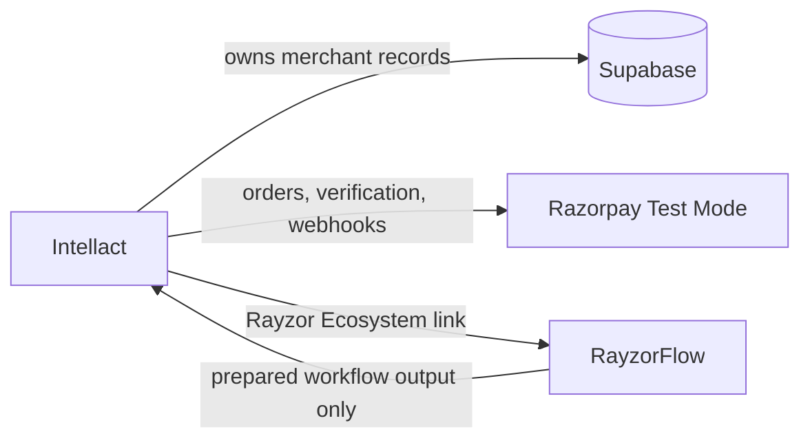
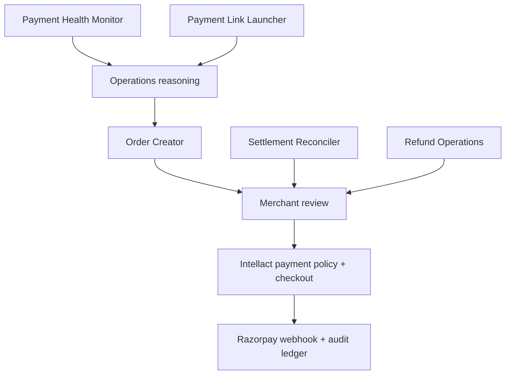

# Intellact × RayzorFlow Ecosystem

This document defines how the two local products work together today and the rules for extending that connection safely.

## Product roles

| Product | Port | Job | Must not own |
|---|---:|---|---|
| **Intellact** | `3000` | Merchant CRM, campaign/landing workflow, customer and payment intelligence, Razorpay checkout, payment audit | Execution-graph authoring |
| **RayzorFlow** | `3001/app` | Visual composition, dependency ordering, parallel groups, prepared commerce workflow outputs | Customer database, payment credentials, autonomous money movement |



## Current integration contract

The active integration is intentionally small:

1. A user clicks **Rayzor Ecosystem** in Intellact.
2. The browser opens `http://localhost:3001/app`.
3. The user composes and runs a RayzorFlow graph.
4. Commerce nodes return a prepared, reviewable output. They never dispatch a Razorpay action or contact a customer automatically.

There is no implicit tenant transfer, no cross-origin cookie sharing, and no shared database. That means a node must not assume it knows the active Intellact merchant, campaign, payment, or customer.

## Commerce orchestration pattern



## Collision policy

The following rules prevent the most common multi-agent mistakes:

1. **One owner per record.** Intellact owns campaign, customer, payment, and audit data. RayzorFlow receives no write permission for them.
2. **One dispatcher per side effect.** Only the Intellact payment path can call Razorpay. RayzorFlow can emit a proposal, never execute it.
3. **Declared dependencies only.** A node may consume only upstream outputs represented by a canvas edge; unrelated context must not be assumed.
4. **Unique roles.** Commerce agent IDs are namespaced: `razorpay-payment-health`, `razorpay-order-creator`, `razorpay-payment-link`, `razorpay-refund-ops`, and `razorpay-settlement-reconciler`.
5. **Parallelism is not permission.** A RayzorFlow parallel group only says nodes have no graph dependency. It does not approve calls, messages, refunds, or collection.
6. **Human review before money movement.** Prepared outputs use `approval_required`; Intellact’s deterministic policy and audit rules decide whether a real Razorpay request may proceed.

## Future structured hand-off

When the link evolves beyond browser navigation, add a small, explicit contract rather than a shared database.

```ts
type OrchestrationContext = {
  version: "1";
  merchantId: string;
  campaignId?: string;
  correlationId: string;
  issuedAt: string;
  expiresAt: string;
  allowedActions: readonly string[];
};
```

Required controls before implementing it:

- authenticated merchant identity and tenant scope;
- short expiry plus a correlation / idempotency key;
- signed schema validation at both boundaries;
- allow-listed actions, never arbitrary tool execution;
- audit event written before and after an approved side effect;
- payment policy check in Intellact immediately before the Razorpay call.

## Run locally

```powershell
# Intellact
cd C:\Users\HP\Desktop\Razorpay-AI-Builder-main
npm run dev

# RayzorFlow (a second terminal)
cd C:\Users\HP\Desktop\FlowMon-main\FlowMon
npm run dev
```

Verify the hand-off by opening `http://localhost:3000` and selecting **Rayzor Ecosystem**. The target is configurable via `NEXT_PUBLIC_RAYZORFLOW_URL` and defaults to `http://localhost:3001/app`.
