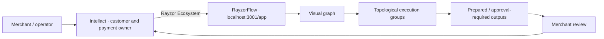
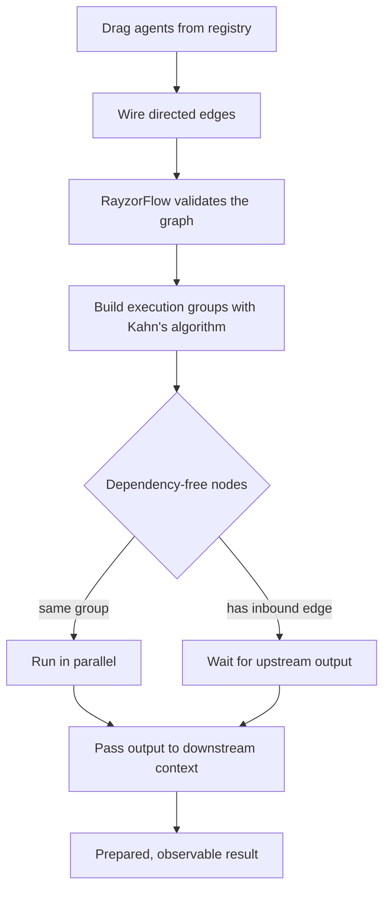
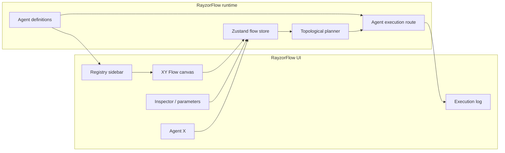

# RayzorFlow

### Visual orchestration for governed commerce-agent workflows

RayzorFlow is a standalone workflow canvas for composing specialist agents, declaring dependencies, and executing only the nodes that are safe to run in parallel. It complements **Intellact**; it does not replace the CRM, merchant record, Razorpay integration, or audit ledger.

## Product contract



| RayzorFlow owns | Intellact owns |
|---|---|
| Agent registry, graph canvas, execution order, parallel groups, prepared workflow outputs | Merchant identity, customer records, campaigns, payment credentials, Razorpay Checkout, policies, and audit history |

## Commerce agents

| Agent | ID | What it does | Side-effect policy |
|---|---|---|---|
| Payment Health Monitor | `razorpay-payment-health` | Prepares a payment-success and recovery review | Readiness signal only |
| Order Creator | `razorpay-order-creator` | Prepares an INR order proposal | Merchant approval required |
| Payment Link Launcher | `razorpay-payment-link` | Prepares customer payment-link outreach | Merchant approval required |
| Refund Operations | `razorpay-refund-ops` | Validates a refund proposal and reason | Merchant approval required |
| Settlement Reconciler | `razorpay-settlement-reconciler` | Prepares a settlement exception review | Readiness signal only |

The current implementations intentionally return `ready` or `approval_required`. They do not call Razorpay, issue refunds, create orders, or send customer messages.

## How a flow runs



`src/lib/execution-engine.ts` builds ordered groups from node in-degrees. This prevents a downstream node from running until each represented upstream dependency has finished. It is execution ordering, not an authorization mechanism.

## Agent-clash policy

| Clash risk | RayzorFlow rule |
|---|---|
| Duplicate commerce agents | Use unique, namespaced `razorpay-*` IDs. |
| Invalid order of work | Connect a directed edge; the execution engine places downstream work in a later group. |
| Parallel branches touching money | A parallel group grants no financial permission. Commerce agents only prepare outputs. |
| Stale or ambiguous context | RayzorFlow has no implicit access to Intellact customer or payment data. Bring a reviewed context explicitly. |
| Duplicate payment/refund dispatch | Not possible through RayzorFlow today; the Intellact payment path remains the sole dispatcher. |

## Architecture



## Local development

```powershell
cd C:\Users\HP\Desktop\FlowMon-main\FlowMon
npm install
npm run dev
```

RayzorFlow runs at [http://localhost:3001/app](http://localhost:3001/app). In a second terminal, run Intellact at `http://localhost:3000`; then select **Rayzor Ecosystem** from its sidebar.

```powershell
npm run typecheck
npm run build
```

## Project map

```text
src/
  app/
    app/page.tsx                 workflow canvas composition
    api/agents/[agentId]/        commerce and specialist-agent handlers
    api/agent-execute/           execution router
  components/
    canvas/                      graph, nodes, inspector, activity, log
    registry/                    searchable agent catalog
    agent-x/                     workflow copilot
  data/agent-registry.ts         agent definitions and parameters
  lib/execution-engine.ts        dependency planning and parallel groups
  lib/amp.ts                     typed inter-agent message envelope
  store/flow-store.ts            canvas and execution state
```

## Ecosystem integration

The current integration is intentionally a local browser hand-off:

```text
http://localhost:3000  Intellact
      └─ Rayzor Ecosystem → http://localhost:3001/app  RayzorFlow
```

For the cross-product architecture, context contract, and extension guardrails, see Intellact's [ecosystem documentation](../../Razorpay-AI-Builder-main/Docs/ecosystem.md).
