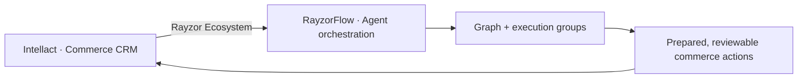

# RayzorFlow Ecosystem

This repository contains **RayzorFlow**, the visual agent orchestrator used alongside Intellact.



RayzorFlow is deliberately not a payment system or CRM. It manages workflow topology and prepared outputs; Intellact remains the owner of customer context, Razorpay operations, policies, and audit records.

## Start locally

```powershell
cd FlowMon
npm install
npm run dev
```

Open [http://localhost:3001/app](http://localhost:3001/app). Start Intellact separately on `http://localhost:3000`, then open **Rayzor Ecosystem** from its sidebar.

The canonical RayzorFlow documentation lives in [FlowMon/README.md](./FlowMon/README.md).
