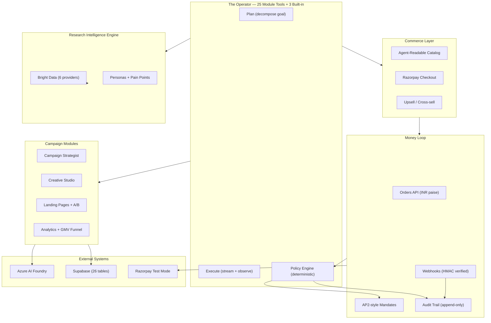

# MediaOS — Autonomous Merchant Growth Agent

### Razorpay AI Buildathon 2026 | Track 01: AI Growth & Agentic Commerce

> An AI agent that researches Indian buyers, deploys campaigns, collects ₹ through Razorpay test-mode Checkout, and optimizes with a policy-gated audit trail on every money action.

[](https://mediaos-kappa.vercel.app)
[](https://mediaos-kappa.vercel.app/api/commerce/catalog)
[](#testing)
[](https://razorpay.com/buildathon/)

---

## Track 01 Bar Compliance

| Requirement | How MediaOS meets it |
|-------------|---------------------|
| **Every money action explainable** | `reason` (min 24 chars) + `evidence[]` on every audit event |
| **Every money action bounded** | ₹5K order cap, ₹50K campaign cap, 20/10min rate limit, integer paise |
| **Every money action gated** | Deterministic policy engine (not LLM); AP2-style mandate persisted before Razorpay call |
| **Audit trail shown** | `explain_money_action` tool + campaign audit timeline |
| **One failure handled gracefully** | `payment.failed` stop-rule: no retry on same order; webhook audit event |

**All four example directions shipped:** Campaign orchestrator, Conversational checkout, Agent-readable catalog, Upsell & cross-sell agent.

---

## Architecture



---

## What it does (30 seconds)

1. **Researches** Indian buyers with 6 live Bright Data providers (competitor ads, search intent, Reddit, news, social, web intelligence)
2. **Orchestrates** a bounded ₹ campaign with AI-generated creatives and conversion-optimized landing pages
3. **Collects ₹** through Razorpay test-mode Standard Checkout on deployed `/lp/` pages
4. **Exposes** an ACP-inspired agent-readable product catalog at `/api/commerce/catalog`
5. **Upsells** within a signed mandate — policy engine gates every money action
6. **Optimizes** by reallocating budget from worst to best audience based on CPA scorecard
7. **Audits** every action with timestamp, actor, reason, and outcome — including graceful failure handling

---

## Live demo (5-minute judge path)

1. Open **[mediaos-kappa.vercel.app](https://mediaos-kappa.vercel.app)** — Command Center
2. **Operator** → *"Launch an AarogyaFit campaign for fitness-conscious 22-35 year olds"*
3. Watch: research → campaign → creatives → landing page with checkout
4. **Pay** on `/lp/...` with test card `4111 1111 1111 1111` or UPI `success@razorpay`
5. **Audit** → see `order_created` + `payment_captured` with reasons
6. **Failure** → UPI `failure@razorpay` → stop-rule in audit (no retry)
7. **Catalog** → `GET /api/commerce/catalog` returns INR products
8. **Reallocate** → *"Shift budget from audience C to B"* → scorecard + mandate + audit

---

## Tech stack

| Layer | Technology |
|-------|-----------|
| Framework | Next.js 16, React 19.2, TypeScript strict |
| AI | Azure AI Foundry (gpt-5.3-chat + MAI-Image-2.5), Vercel AI SDK v7 |
| Research | Bright Data (SERP API, Web Unlocker, Scraping Browser) |
| Payments | **Razorpay Test Mode** (Orders API, Standard Checkout, Webhooks) |
| Database | Supabase (Postgres + RLS + Auth) — 26 tables, 3 migrations |
| UI | Tailwind v4, shadcn (Base UI), Recharts, Motion |
| Testing | Vitest (507 tests), Playwright (e2e) |
| Deploy | Vercel (Edge + Node runtimes) |

---

## Documentation

| Document | What's inside |
|----------|--------------|
| **[Architecture](Docs/architecture.md)** | System diagrams, data model (26 tables), code topology, external systems |
| **[Payments & Commerce](Docs/payments.md)** | Razorpay integration, policy engine, HMAC, audit trail, catalog |
| **[Operator Tools](Docs/operator-tools.md)** | 25-tool catalog, golden path, artifact types |
| **[Campaigns](Docs/campaigns.md)** | Brief schema, audience allocations, budget plans |
| **[Landing Pages](Docs/landing-pages.md)** | Templates, A/B testing, Razorpay Checkout section |
| **[Analytics](Docs/analytics.md)** | Seeded metrics, anomaly detection, extended GMV funnel |
| **[Research Engine](Docs/research-engine.md)** | OpenBB-inspired TET providers, Bright Data |
| **[ADR 0005](Docs/adr/0005-razorpay-money-loop.md)** | Razorpay money loop design rationale |
| **[Runbook](Docs/runbook.md)** | Setup, migrations, Razorpay test mode, verification |
| **[Track 01 Bar](Docs/buildathon/track-01-bar.md)** | Money-action taxonomy, failure matrix, protocol map |
| **[Protocols](Docs/buildathon/protocols.md)** | UAP / ACP / AP2 / x402 — what we implement vs cite |

---

## What broke and how it was fixed

> The Buildathon form asks: *"What broke and how did you fix it?"*

**1. Razorpay Checkout: "Payment could not be completed"** — The `handler` callback was `async`, causing Razorpay to close the modal before it resolved. Fix: sync handler + fire-and-forget verify + `prefill` for test mode.

**2. Seeded landing page 404 on production** — `/lp/aarogya-fit` worked locally but returned 404 on Vercel because `resolvePublicLanding` queried Supabase (no row) without falling through to the in-memory seeded store. Fix: fallthrough to `seededLandingStore` in both `studio.ts` and `landingService`.

**3. Serverless statelessness: product not found across requests** — `add_product` on instance A; `create_checkout_session` on instance B → "Unknown SKU." Fix: `create_checkout_session` accepts inline `title` + `amountPaise` and auto-creates the product on-the-fly.

**4. Unbounded in-memory stores (memory leak)** — Three stores had no size cap on warm Vercel instances. Fix: FIFO eviction caps (10K/1K/10K).

**5. Cross-sell savings: wrong ₹ amount** — `upsellSkus[0]` was `undefined` for products without upsells → savings = ₹0. Fix: `.reduce()` over all components, `Math.max(0, ...)`.

**6. Type casts bypassing error handling** — Two tools used `as unknown` to return errors, bypassing `runToolSafely`. Fix: `throw new Error()` — the catch boundary converts cleanly.

**7. Hardcoded SKU in Razorpay notes** — `notes: { sku: "AAROGYA-12W" }` sent for every product. Fix: `notes: { sku }` — dynamic from props.

Full postmortem with reproduction steps: [Docs/buildathon/submission-draft.md](Docs/buildathon/submission-draft.md)

---

## Running locally

```bash
git clone https://github.com/Adit-Jain-srm/Razorpay-AI-Builder.git
cd Razorpay-AI-Builder
npm install
cp .env.example .env.local   # fill in credentials
npm run dev
```

The app boots without credentials in degraded demo mode. See **[Docs/runbook.md](Docs/runbook.md)** for full setup including Razorpay Test Mode, Supabase migrations, and verification steps.

<details>
<summary><strong>Environment variables (19 total)</strong></summary>

| Variable | Purpose |
|----------|---------|
| `NEXT_PUBLIC_SUPABASE_URL` | Supabase project URL |
| `NEXT_PUBLIC_SUPABASE_ANON_KEY` | Supabase public anon key |
| `SUPABASE_SERVICE_ROLE_KEY` | Supabase service role (server only) |
| `AZURE_OPENAI_ENDPOINT` | Azure AI Foundry resource endpoint |
| `AZURE_OPENAI_API_KEY` | Azure AI Foundry API key |
| `AZURE_OPENAI_BASE_URL` | OpenAI-compatible v1 base URL |
| `AZURE_OPENAI_GPT4O_DEPLOYMENT` | Chat model deployment name |
| `AZURE_OPENAI_CHAT_DEPLOYMENT` | Chat model (v1 alias) |
| `AZURE_OPENAI_IMAGE_DEPLOYMENT` | Image model deployment name |
| `AZURE_OPENAI_IMAGE_ENDPOINT` | MAI image generations endpoint |
| `AZURE_OPENAI_API_VERSION` | API version (`preview`) |
| `AZURE_AI_PROJECT_ENDPOINT` | Project endpoint for responses API |
| `BRIGHTDATA_API_TOKEN` | Bright Data API token |
| `BRIGHTDATA_WEB_UNLOCKER_ZONE` | Web Unlocker zone |
| `BRIGHTDATA_SERP_ZONE` | SERP zone |
| `BRIGHTDATA_BROWSER_WS` | Scraping Browser WSS endpoint |
| `NEXT_PUBLIC_RAZORPAY_KEY_ID` | Razorpay Test Mode key ID |
| `RAZORPAY_KEY_SECRET` | Razorpay key secret (server only) |
| `RAZORPAY_WEBHOOK_SECRET` | Razorpay webhook secret (server only) |

</details>

---

## Testing

```bash
npm run typecheck   # 0 errors
npm run lint        # 0 errors
npm test            # 507 passing, 53 files
npm run build       # success
npm run smoke:razorpay  # live Razorpay test-mode order (creds required)
```

Test coverage: HMAC (checkout + webhook), policy engine (8 checks), catalog schema, growth scorecard, audit service, extended funnel, product catalog, env predicates.

---

## License

MIT
