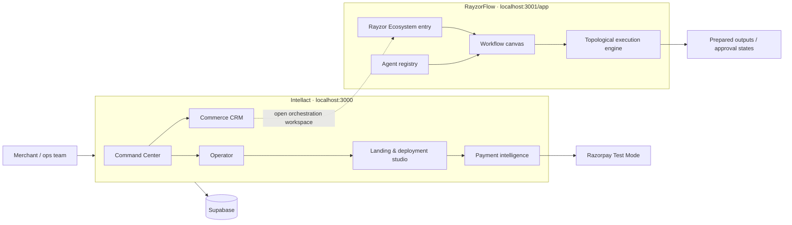
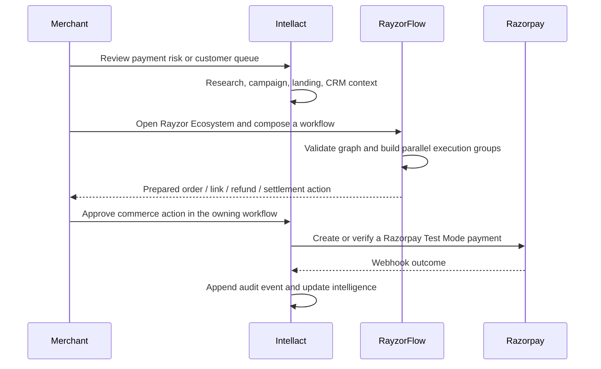

# Intellact

### AI-native commerce CRM with a governed RayzorFlow agent ecosystem

> Intellact is the merchant workspace for audience intelligence, campaign execution, customer conversations, landing-page deployment, and payment analysis. RayzorFlow is its companion orchestration canvas: it composes specialist workflows without taking ownership of merchant data or money movement.

## What is in this repository

| Product surface | Responsibility | Source of truth |
|---|---|---|
| **Intellact Command Center** | Merchant operations, campaigns, creative, landing pages, analytics | Intellact services + Supabase when configured |
| **Commerce CRM** | Revenue call queue, payment risk, recovery opportunity, response SLA | Intellact workspace (`/commerce`) |
| **Operator** | Typed, Zod-validated research, campaign, landing, analytics, and commerce tools | Intellact service layer |
| **Rayzor Ecosystem** | Opens the visual agent-workflow canvas | Separate RayzorFlow app on `localhost:3001/app` |
| **Razorpay Checkout** | Orders, payment verification, webhooks, audit trail | Razorpay Test Mode + Intellact payment policy |

## Ecosystem architecture



### The ownership rule

**Intellact owns customer context and commerce outcomes. RayzorFlow owns execution order.** The apps intentionally do not share a database, browser session, credentials, or autonomous money authority. The current integration is a navigation hand-off from **Rayzor Ecosystem** to `http://localhost:3001/app`.

That separation makes the system easier to reason about: any future structured hand-off must be explicit, validated, scoped to a merchant, and approved before it can change a payment state.

## A commerce flow, end to end



## Preventing agent clashes

An agent clash is any situation where two agents act on conflicting context, race to perform a money action, or silently reuse another agent’s output. The system reduces that risk at four levels:

| Risk | Guardrail implemented today |
|---|---|
| Duplicate agent identities | RayzorFlow commerce agents use a dedicated `razorpay-*` ID namespace. |
| Wrong execution order | RayzorFlow turns the canvas graph into topological execution groups; downstream nodes wait for inbound edges. |
| Concurrent independent work | Only dependency-free nodes share a parallel group. |
| Unapproved financial action | RayzorFlow commerce agents return `approval_required` / prepared outputs. Intellact’s deterministic payment policy, Razorpay checkout flow, and audit ledger remain the financial authority. |
| Hidden data coupling | No direct database or credential sharing exists between Intellact and RayzorFlow. |

## RayzorFlow commerce agents

| Agent | Purpose | Output state |
|---|---|---|
| Payment Health Monitor | Analyze payment success, failure, and recovery context | `ready` |
| Order Creator | Build an INR order proposal | `approval_required` |
| Payment Link Launcher | Prepare customer payment-link outreach | `approval_required` |
| Refund Operations | Validate a refund request and reason | `approval_required` |
| Settlement Reconciler | Prepare a settlement exception review | `ready` |

These agents currently prepare governed workflow outputs. They do **not** call Razorpay or contact customers autonomously.

## Local development

Run the two apps in separate terminals.

```powershell
# Terminal 1 — Intellact
cd C:\Users\HP\Desktop\Razorpay-AI-Builder-main
npm install
npm run dev
# http://localhost:3000
```

```powershell
# Terminal 2 — RayzorFlow
cd C:\Users\HP\Desktop\FlowMon-main\FlowMon
npm install
npm run dev
# http://localhost:3001/app
```

Open **Intellact → Rayzor Ecosystem** to enter the RayzorFlow canvas. The target can be overridden for another environment with `NEXT_PUBLIC_RAYZORFLOW_URL`; it defaults to `http://localhost:3001/app`.

## Core Intellact capabilities

- Audience intelligence from research providers, synthesized into personas, pain points, opportunities, and cited sources.
- Campaign briefs, channel allocation, creative generation, landing-page creation, A/B testing, and performance intelligence.
- Public landing pages with lead capture, UTM attribution, page-view tracking, and Razorpay Checkout support.
- Commerce CRM workspace for payment-risk visibility, customer-call prioritization, and revenue-recovery planning.
- Razorpay Test Mode orders, webhook verification, deterministic policy checks, and append-only audit events.
- A typed AI Operator that uses the same underlying services as the manual product surfaces.

## Code map

```text
src/
  app/(dashboard)/        Intellact product routes, including commerce/
  app/api/                checkout, commerce, webhooks, research, operator APIs
  app/lp/[slug]/          public deployed landing pages
  components/             UI, CRM, analytics, operator, and landing-page surfaces
  lib/agent/              typed Operator runtime and tool registry
  lib/payments/           policy, Razorpay client, HMAC, catalog, audit
  lib/research/           provider registry, orchestration, analysis
  lib/services/           campaign, creative, landing, and analytics contracts
  lib/nav.ts              Intellact navigation and Rayzor Ecosystem hand-off
Docs/                     architecture, ecosystem boundary, runbook, and module docs
```

## Documentation

| Document | Contents |
|---|---|
| [Architecture](Docs/architecture.md) | Intellact system boundaries, data flow, and safety controls |
| [Ecosystem & orchestration](Docs/ecosystem.md) | Intellact ↔ RayzorFlow hand-off, agent contract, clash prevention |
| [Payments](Docs/payments.md) | Razorpay integration and money-action policy |
| [Operator tools](Docs/operator-tools.md) | Typed tool catalog and execution loop |
| [Landing pages](Docs/landing-pages.md) | Deployment, testing, lead capture, and Checkout surfaces |
| [Runbook](Docs/runbook.md) | Local setup, two-app startup, verification, and deployment notes |

## Verification

```powershell
npm run typecheck
npm run build
```

The Intellact project builds with Next.js 16, React 19, TypeScript, Tailwind CSS, shadcn, Motion, Recharts, Supabase, Azure AI Foundry, and Razorpay Test Mode.
